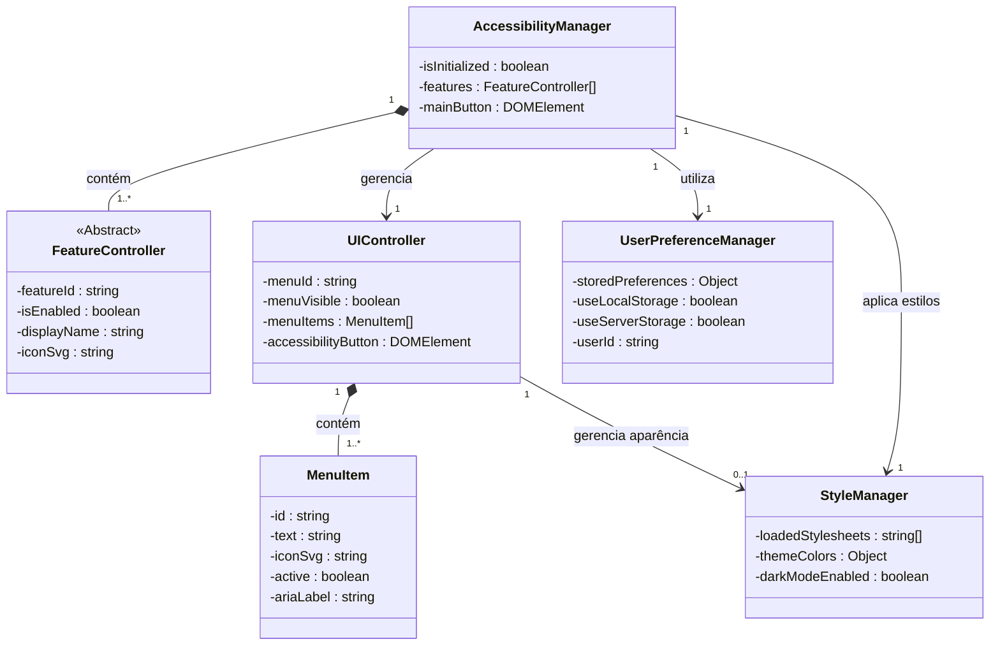

# Diagrama de Classes do Plugin AGUIA - Componentes de Acessibilidade

## Introdução

Este documento apresenta o diagrama de classes para os principais componentes do plugin AGUIA de Acessibilidade. O diagrama ilustra as relações entre as classes que compõem o sistema, destacando os atributos com suas respectivas visibilidades e tipos, além das multiplicidades nos relacionamentos.

